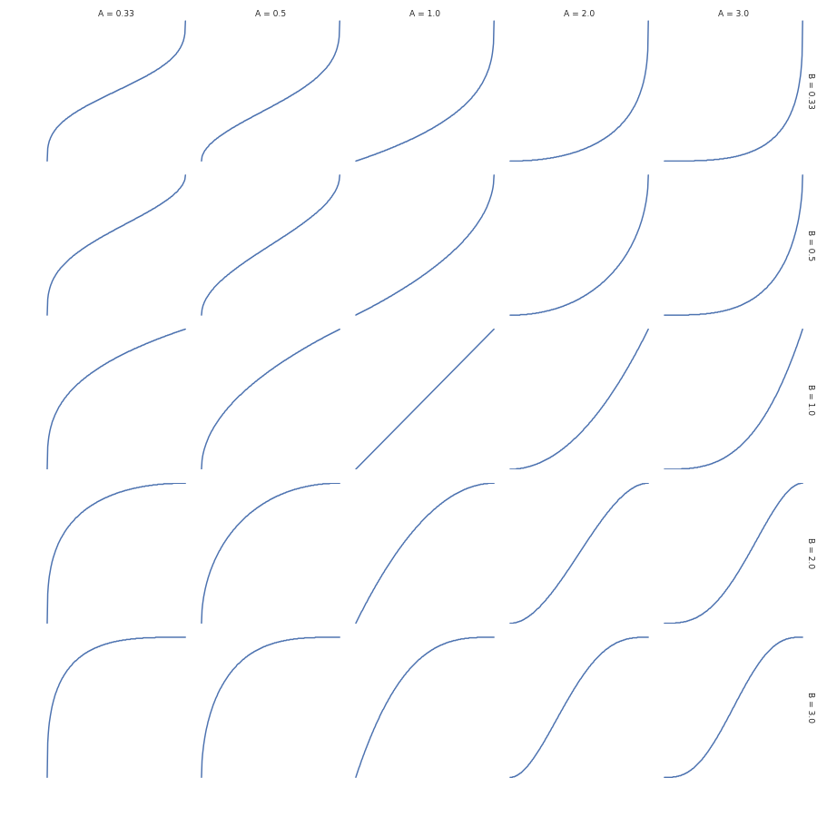

betapot
========

Generate and plot potentiometer curve lookup table using Beta CDF.

There are two parameters that determine the curve shape: A and B. If both are 1,
the curve is linear.  If <1, that part of the curve (bottom or top) becomes
steeper.  If >1 it becomes flatter.

Below is a grid of plots showing how parameters affect the curve. X axis is
input, Y axis is output.

Outputs comma separated values suitable for inclusion in a C array.

Setup
-----

To install dependencies run

.. code:: sh

  pip3 install --user -r requirements.txt

Usage
-----

.. code::

  usage: betapot.py [-h] [--no-plot] [--size SIZE] [--min MIN] [--max MAX]
                     [--output OUTPUT]
                     A B

  positional arguments:
    A                bottom flatness
    B                top flatness

  optional arguments:
    -h, --help       show this help message and exit
    --no-plot        don't plot preview
    --size SIZE      size of lookup table (default: 256)
    --min MIN        minimum output value (default: 0)
    --max MAX        maximum output value (default: 255)
    --output OUTPUT  output file (default: stdout)

For example, save a curve to `pot.inc` using

.. code:: sh

  ./betapot.py --no-plot --output=pot.inc 0.9 1.3

then include the file from your C code:

.. code:: c

  static const uint8_t pot_curve[] = {
  #include "pot.inc"
  };

